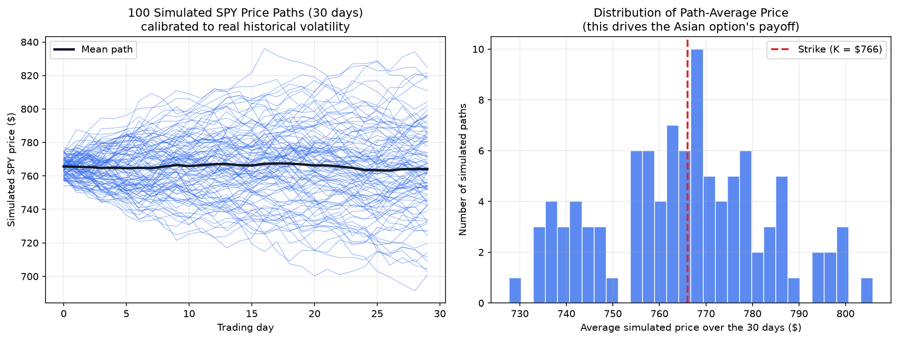
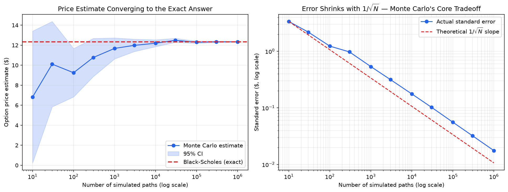

# Monte Carlo Options Pricing Engine

A Monte Carlo simulation engine for pricing derivatives, built from first principles
in Python and calibrated to real SPY market data.

## What it does

- Prices a **European call option** via Monte Carlo simulation of Geometric Brownian
  Motion under the risk-neutral measure, with a 95% confidence interval to quantify
  estimator uncertainty
- **Validates** the simulation against the closed-form Black-Scholes formula
- Prices an **Asian (arithmetic average) call option** — a path-dependent payoff with
  no closed-form solution, which is the actual reason trading desks reach for Monte
  Carlo over analytic formulas
- **Calibrates volatility** using real historical SPY price data (included), and
  compares it against real market-implied volatility to illustrate the
  historical-vs-implied volatility gap
- Runs a **convergence analysis**, empirically confirming Monte Carlo's O(1/√n)
  error decay

## Results

| Model | Price |
|---|---|
| European call — Monte Carlo (200,000 paths) | $12.35, 95% CI ($12.27, $12.43) |
| European call — Black-Scholes (exact) | $12.34 |
| European call — priced with market-implied vol | $12.11 |
| Asian call — Monte Carlo | $7.17 |

## How to run it

Requires Python 3 with `numpy`, `pandas`, `scipy`, `matplotlib`:

\`\`\`
pip3 install numpy pandas scipy matplotlib
python3 monte_carlo_options_model.py
\`\`\`

Both `monte_carlo_options_model.py` and `spy_us_d.csv` must be in the same folder.

## Limitations

- Market-implied volatility and the risk-free rate are hardcoded values sourced from
  public market data as of August 2026 — not a live feed, so they don't update on rerun
- Assumes constant volatility (no volatility smile/skew modeling)
- Asian option uses arithmetic averaging with daily monitoring; no early-exercise
  (American-style) feature
